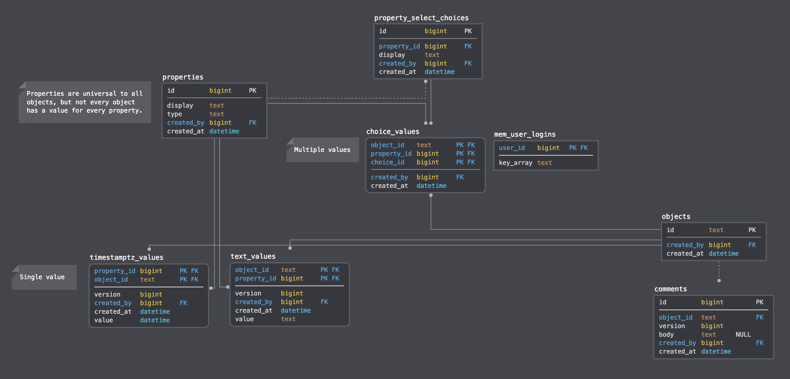

# dewey

Files here are part of the "Collect" project.

"Collect" is the collection part of the grander "Dewey" project.

The Dewey Project is a grand effort to improve how documents and media are organized across systems which targets comprehension heavy professionals such as doctors, lawyers, and accountants.

The objective is to enable these professionals the opportunity to quickly index and organize their sources in several places potentially across multiple devices without redacting information.

## Reference SQL

## Autoreload

Referencing [Actix_web Autoreload docs](https://actix.rs/docs/autoreload/), install both `systemfd` and `cargo-watch` with `cargo install systemfd cargo-watch`.

Then, you will be able to run `bash ./dev-watch.sh` to enable autoreloading actix-web server.
