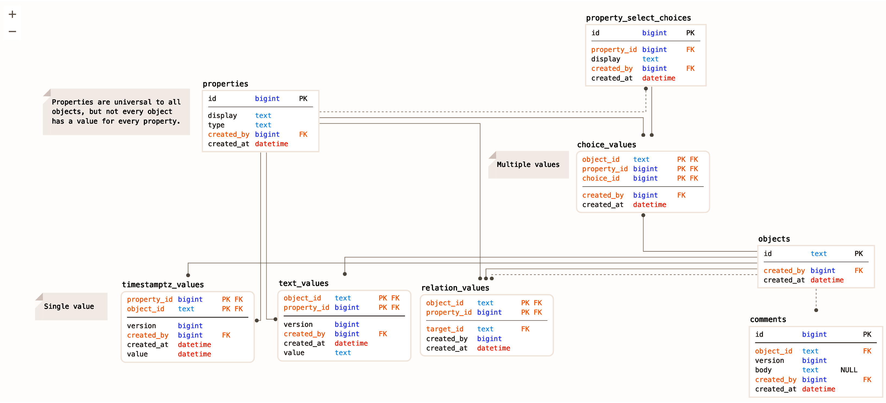
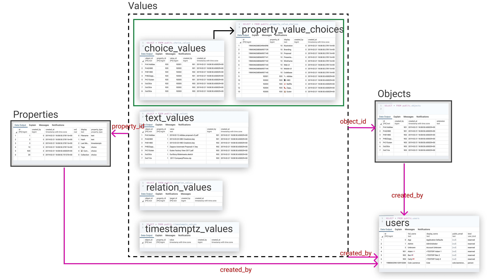

# dewey

Files here are part of the "Collect" project.

"Collect" is the collection part of the grander "Dewey" project.

The Dewey Project is a grand effort to improve how documents and media are organized across systems which targets comprehension heavy professionals such as doctors, lawyers, and accountants.

The objective is to enable these professionals the opportunity to quickly index and organize their sources in several places potentially across multiple devices without redacting information.

## Reference SQL

## Autoreload

Referencing [Actix_web Autoreload docs](https://actix.rs/docs/autoreload/), install both `systemfd` and `cargo-watch` with `cargo install systemfd cargo-watch`.

Then, you will be able to run `bash ./dev-watch.sh` to enable autoreloading actix-web server.

## Getting Started

### Prerequisites:

1. Install [Rust (Stable)](https://www.rust-lang.org/tools/install) `curl https://sh.rustup.rs -sSf | sh`
    Make sure you can run `rustup default stable` and `cargo --version`
2. Install docker [Docker CE](https://hub.docker.com/search/?type=edition&offering=community)
    Make sure you have `docker-compose` in your path.
3. Install Rust PostgreSQL CLI tool "diesel" `cargo install diesel_cli --no-default-features --features postgres`
    Make sure you can run `diesel --version`
4. Install development tools `cargo install systemfd` & `cargo install cargo-watch`
    You should be able to run `bash ./dev-watch.sh` and it should crash since the database likely isn't configured yet.

### Setup Database:

1. Copy `.env.example` to `.env` for diesel to know where the DATABASE_URL is ([diesel getting started guide](http://diesel.rs/guides/getting-started/)).
2. Start the Posgres, Redis, and Minio services we need `docker-compose up`
3. Setup the database `diesel setup` (This uses the [`./migrations/` SQL files](./migrations/))

### Setup Google App:

This application requires that you are using a google apps account to create an app and credentials.
1. Create a Google Apps project
2. Update the other `.env` file variables for your Google App keys
3. Add credentials for OAuth 2 web client (This step requires having endpoints created for your web service, you might use something like Authorised redirect URIs: `http://localhost:8088/login/google/callback`)
4. If you used `http://localhost:8088` in the app, you need to update the `ROOT_HOST` in the `.env` file to match.

### Start server

Starting the server should be as straight forward as running `bash ./dev-watch.sh`, which provides recompilation on watch, and restarting on successful recompilation.

## Contributing

If at any point you scratched your head reading this guide, please open an issue, or tap us on the shoulder and we can freshen up the guide here to help others in the future.
